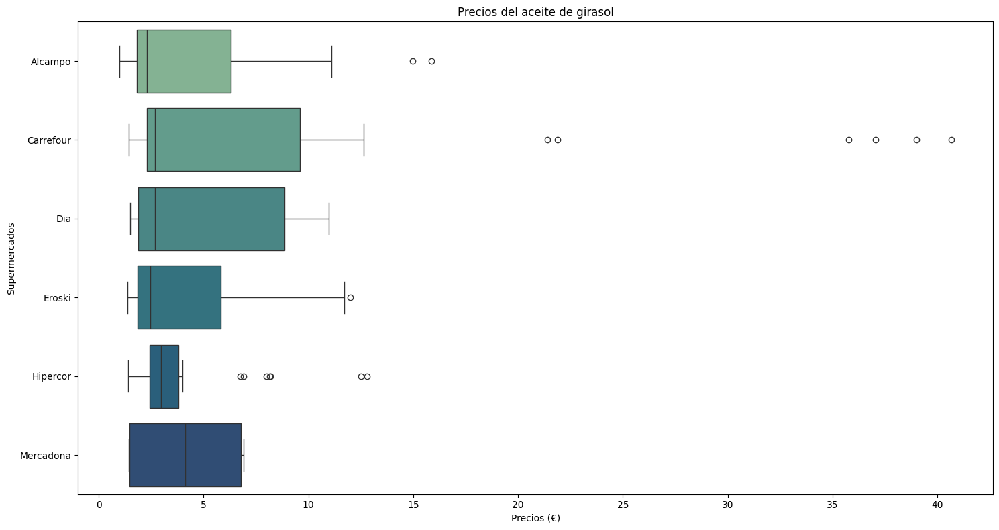
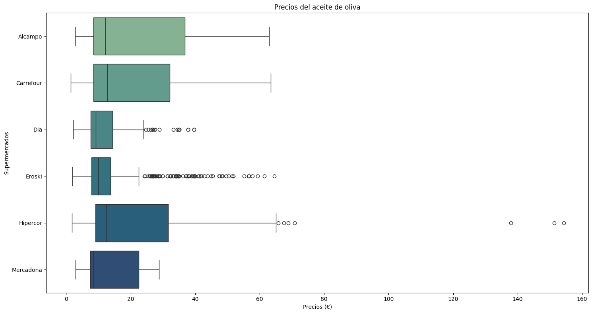
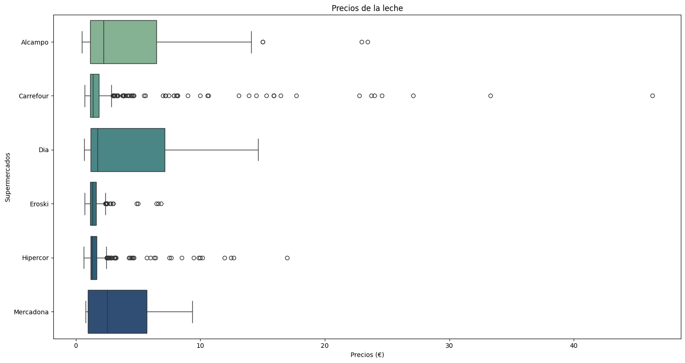

# 📊 Proyecto 4: Analisis de supermercados a través de Facua

## 📖 Descripción del Proyecto

- Este proyecto tiene como objetivo realizar un análisis detallado de los precios de productos en los principales supermercados de España, utilizando herramientas de web scraping, procesamiento de datos y análisis exploratorio de datos. La fuente principal de información será la plataforma FACUA: Precios Supermercados, una página que publica precios actualizados de productos básicos en supermercados como Alcampo, Carrefour, Dia, Eroski, Hipercor y Mercadona.

- A partir de los datos recolectados, se construirá una base de datos en SQL para almacenar la información de manera estructurada. Esto permitirá llevar a cabo un análisis exhaustivo sobre la comparación entre supermercados en base a los precios de los productos. Los resultados de este análisis se presentarán mediante visualizaciones, facilitando la identificación de diferencias significativas de precios y la comprensión de la evolución de los mismos a lo largo del tiempo.

## 🎯 Objetivos del proyecto

1. Scraping de datos: Extraer información detallada de todos los productos listados en la web de FACUA para cada supermercado, obteniendo datos de precios actualizados y organizados.

2. Almacenamiento en base de datos: Construir una base de datos SQL que almacene la información recolectada, asegurando su integridad y accesibilidad para el análisis posterior.

3. Análisis de Datos:

    - Comparación de Precios entre Supermercados: Identificar qué supermercados ofrecen los precios más competitivos y cuáles tienden a ser más caros, para cada producto específico.
    - Análisis de la Evolución de Precios: Evaluar la tendencia de los precios en los distintos supermercados a lo largo del tiempo, observando posibles patrones o cambios significativos.
    - Detección de Anomalías: Identificar subidas o bajadas de precios inusuales que podrían señalar prácticas abusivas o promociones.

4. Visualización de Datos: Crear gráficos y visualizaciones que permitan una comprensión clara de los resultados obtenidos en el análisis, facilitando la comparación y el seguimiento de las fluctuaciones de precios entre los diferentes supermercados.

## 🗂️ Estructura del Proyecto

El proyecto está organizado de la siguiente manera:

```bash
├── datos/                # Conjuntos de datos sin procesar y ya procesados
│   ├── output/           # Datos procesados y resultados finales
│   └── raw/              # Datos en bruto (sin procesar)
│
├── imagenes/             # Recursos gráficos para el README y el proyecto
│
├── notebooks/            # Notebooks con el contenido y análisis de datos
│
├── src/                  # Scripts para la limpieza y procesamiento de datos
│
├── README.md             # Descripción general del proyecto e instrucciones
└── requirements.txt      # Lista de dependencias del proyecto
```

## 🛠️ Instalación y Requisitos

Este proyecto utiliza [Python 3.12.7](https://docs.python.org/3.12/) y requiere las siguientes bibliotecas para la ejecución y análisis:

- [pandas 2.2.3](https://pandas.pydata.org/docs/)
- [matplotlib 3.9.2](https://matplotlib.org/stable/index.html)
- [seaborn 0.13.2](https://seaborn.pydata.org/tutorial.html)
- [beautifulsoup4 4.12.3](https://www.crummy.com/software/BeautifulSoup/bs4/doc/)
- [selenium 4.25.0](https://www.selenium.dev/documentation/)
- [asyncio 3.4.3](https://docs.python.org/3.12/library/asyncio.html)
- [psycopg2 2.9.10](https://www.psycopg.org/docs/)

Para instalar las dependencias, puedes ejecutar el siguiente comando dentro de un entorno virtual:

```bash
pip install -r requirements.txt
```

## 📊 Resultados y Conclusiones

Tras analizar los datos recogidos sobre los precios de cada categoria de productos se han generado diferentes gráficos.




- Conclusión de la comparativa de precios del *aceite de girasol*:
    - En cuanto a los precios más bajos **Eroski** e **Hipercor** son las opciones más económicas. La diferencia de precio con respecto al resto de supermercados es bastante notable. De otra forma, **Carrefour** presenta un precio significativamente más alto. Con respecto a los precios más altos **Carrefour** sigue destacando como el supermercado más caro.
    - Para este producto, **Eroski** e **Hipercor** son las mejores opciones para aquellos que buscan ahorrar, mientras que Carrefour se muestra la opción menos competitiva.





- Conclusión de la comparativa de precios del *aceite de oliva*:
    - **Carrefour** y **DIA** son los supermercados más asequibles, seguidos de cerca por **Eroski** y **Mercadona**.
    **Alcampo** e **Hipercor** tienen precios notablemente superiores.
    - Los supermercados **Carrefour**, **DIA**, **Eroski** y **Mercadona** ofrecen precios bastante competitivos porlo que se ajustan al precio de mercado con el fin de elegir cualquiera de estos supermercados para comprar este producto.





Además, **Eroski** sigue siendo el más barato en cuanto a la media de precios más caros con 1.55€.
**Carrefour** se mantiene como el más caro dentro de la media de precios bajos con 4.23€.

- Conclusión de la comparativa de precios de la *leche*:
    - En cuanto a los precios más bajos **Eroski** e **Hipercor** son las opciones más económicas una vez más. Los precios en **Alcampo**, **Carrefour**, y **DIA** son muy similares y se encuentran en un nivel intermedio-alto, mientras que **Mercadona** tiene un precio notablemente superior.
    - Para realizar la compra de este producto, **Eroski** e **Hipercor** siguen siendo las mejores opciones para aquellos que buscan economizar, mientras que Mercadona tiende a precios más elevados.

- Conclusión final:
    - En estas comparativas, podemos apreciar como **Eroski** e **Hipercor** ofrecen precios bajos y consistentes en los productos como el *aceite de girasol* y la *leche*, posicionándose como una opción económica para consumidores que buscan ahorrar. Algo a tener en cuenta es que parece ser que esto se debe a su falta de variedad en cada categoria de productos. Sin embargo, **Carrefour** y **DIA** destacan en precios competitivos para el *aceite de oliva*. **Mercadona** y **Alcampo** tienen un comportamiento variable con precios, en algunos productos, más elevados. Especialmente en la *leche* para el caso de **Mercadona** y el *aceite de oliva* para el caso de **Alcampo**.

## 🔄 Próximos Pasos

- Implementar en el análisis la detección de anomalias y la dispersión de precios.
- Ampliar la busqueda de historiales de los últimos 30 días para hacer un análisis más preciso.
- Optimización de la obtención de URLs en las que se encuentran los datos historicos.
- Aumentar la precisión del análisis separando por capacidad de los envases.

## 🤝 Contribuciones

Las contribuciones son bienvenidas. Si deseas colaborar en este proyecto, por favor abre un pull request o una issue en este repositorio.

## ✒️ Autores

Iván Bravo - Autor principal del proyecto.